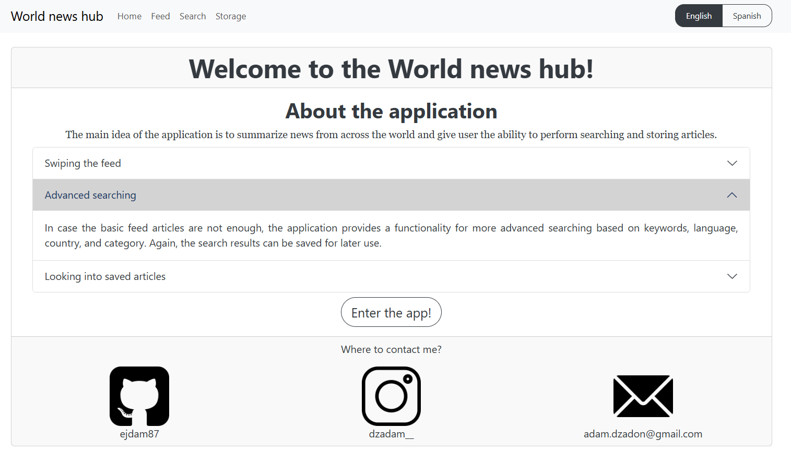
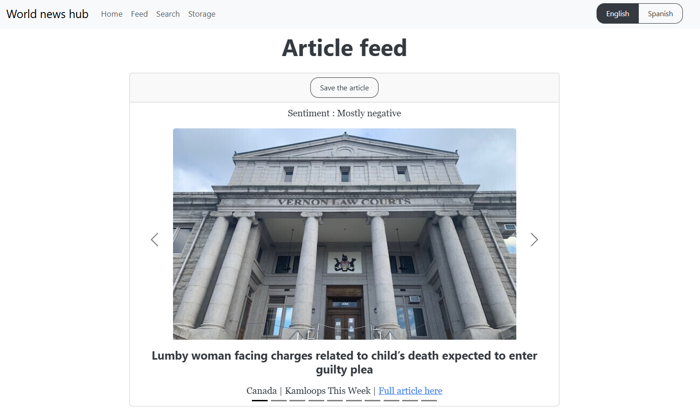
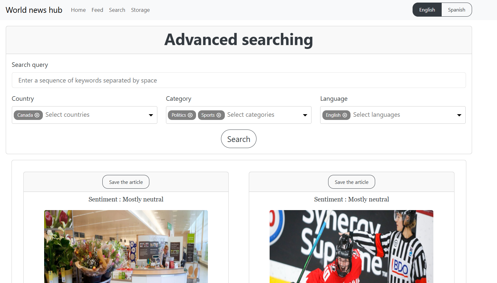
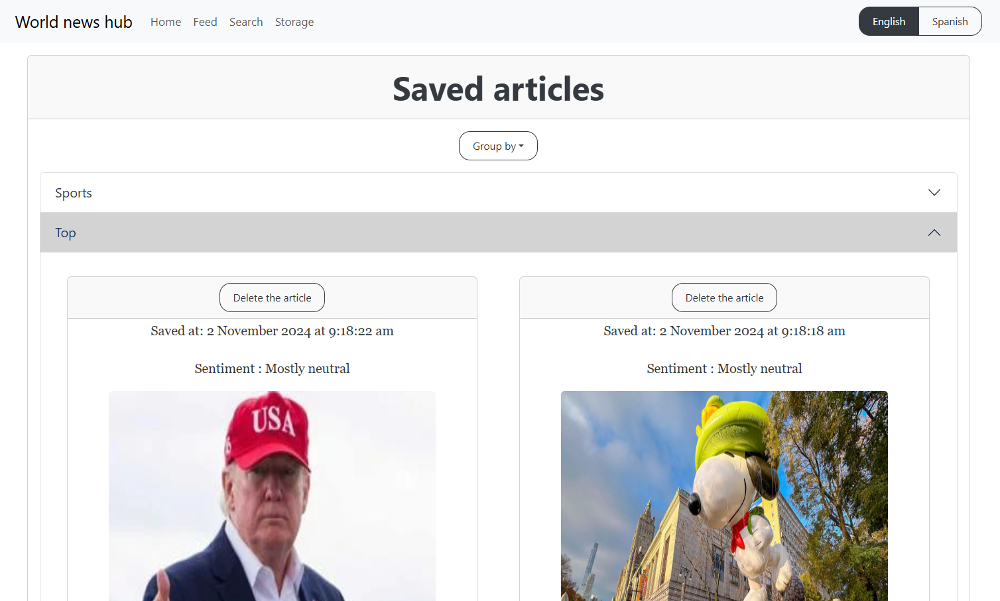

# World news hub
The main idea of the application is to summarize news from across the world and give user the ability to perform article searching, storing, and more. Each part of the application is described at the "Home" page in great detail. Also, the application is fully responsive, thus, it can be used on laptop, tablet, or even a smartphone.

## Development dependencies
- [Node.js](https://nodejs.org/en) runtime environment
    - [Vite.js](https://v2.vitejs.dev/) development server

The application is built using [React.js](https://react.dev/) library. All the project-specific dependencies are listed in `package.json` file. They can be installed using Node package manager (running `npm install` in the root directory of the project).

Also, you should obtain access token for the following APIs:
- [HuggingFace](https://huggingface.co/)
- [NewsAPI](https://newsdata.io/documentation)

Also, you should include these in `.env` file in the root directory of the project.

## Execution
Currently, the application is not deployed, thus, there are no transpiled JS files available. The application can be run using Vite development server (running `npm run dev` in the root directory of the project) and then connecting to the server from the web browser.

## Functionality description
The application currently comprises 4 sub-applications:
- Home
- Feed
- Search
- Storage

Also, the content is available in (currently) two languages:
- English
- Spanish

### Home
This is the "Home" of the whole application. It includes basic information about the application, and mainly, how to use each sub-application. Together with that, there is a contact information for the author and the button to enter the functional part of the application.

### Feed
Feed allows user to access a group of random articles (articles are acessed using [NewsAPI](https://newsdata.io/documentation) public API) in a similar fashion used in famous social network applications. For each article in the feed, the sentiment analysis of article heading is performed (using [HuggingFace](https://huggingface.co/) public API) and besides other information about the article, there is also a link to the full article. Finally, there is an option to save the article and see it later (see "Storage" section).

### Search
This sub-application gives user the ability to perform more advanced searching compared to Feed swiping. Specifically, user is able to specify its searching by entering:
- A sequence of keywords separated by spaces
- A list of countries of origin (at most 5 entries)
- A list of topic categories (at most 5 entries)
- A list of article languages (at most 5 entries)

This time, the articles are displayed differently, however, the option to store the articles for later is again available.

### Storage
This sub-application allows user to access previously stored articles. For article storing, we use [JSONBN](https://jsonbin.io/api-reference) public API. Besides that, it also allows user to (optionally) group stored articles based on one of the following attributes:
- Country
- Category (used in picture bellow)
- Language
- Sentiment

The idea behind this is to provide a bit of hierarchy to the storage. Finally, it gives user ability to delete the articles from the storage.
